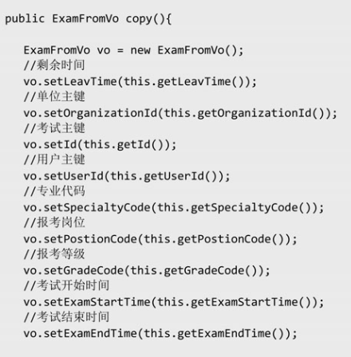

### 工厂模式

#### 1. 简单工厂模式

##### 定义

简单工厂模式（Simple Factory Pattern）又叫作静态工厂方法模式（Static Factory MethodPattern），简单来说，**简单工厂模式有一个具体的工厂类，可以生成多个不同的产品**，属于创建型设计模式。

##### 应用场景

对于产品种类相对较少的情况，考虑使用简单工厂模式可以很方便地创建所需产品。

##### UML类图


##### 核心角色

（1）简单工厂（SimpleFactory）：是简单工厂模式的核心，负责实现创建所有实例的内部逻辑。工厂类的创建产品类的方法可以被外界直接调用，创建所需的产品对象。

（2）抽象产品（IProduct）：是简单工厂创建的所有对象的父类，负责描述所有实例共有的公共接口。

（3）具体产品（ConcreteProduct）：是简单工厂模式的创建目标。

```java
public class Client{
    psvm(){
        new SimpleFactory.makeProduct(1);
    }
}
// 抽象产品
public interface IProduct{
    void doSomething();
}

// 具体产品
static class ProductA implements IProduct {
	public void doSomething() {
        System.out.println("I am product A");
    }
}

static class ProductB implements IProduct {
	public void doSomething() {
        System.out.println("I am product B");
    }
}

static class ProductC implements IProduct {
	public void doSomething() {
        System.out.println("I am product C");
    }
}
static class SimpleFactory{
    public static IProduct makeProduct(int kind) {
        switch(kind) {
            case 0:
				return new ProductA();
            case 1:
				return new ProductB();
            case 2:
				return new ProductC();
        }
        return null;
    }
}
```

Logback源码中的应用


#### 2. 工厂模式

##### 定义

工厂方法模式（Factory Method Pattern）又叫作多态性工厂模式，指定义一个创建对象的接口，但由实现这个接口的类来决定实例化哪个类，工厂方法把类的实例化推迟到子类中进行。

##### 应用场景

（1）创建对象需要大量重复的代码。

（2）客户端（应用层）不依赖产品类实例如何被创建、实现等细节。

（3）一个类通过其子类来指定创建哪个对象。

##### UML类图


##### 核心角色

（1）抽象工厂（IFactory）：是工厂方法模式的核心，与应用程序无关。任何在模式中创建的对象的工厂类必须		实现这个接口。

（2）具体工厂（ConcreteFactory）：是实现抽象工厂接口的具体工厂类，包含与应用程序密切相关的逻辑，并		且被应用程序调用以创建产品对象。

（3）抽象产品（IProduct）：是工厂方法模式所创建的对象的超类型，也就是产品对象的共同父类或共同拥有的		接口。

（4）具体产品（ConcreteProduct）：这个角色实现了抽象产品角色所定义的接口。某具体产品由专门的具体工		厂创建，它们之间往往一一对应。

##### 说明

- 工厂模式来源于普通工厂方法的痛点：**在简单工厂中，随着产品链的丰富，如果每个课程的创建逻辑都有区别，则工厂的职责会变得越来越多，有点像万能工厂，并不便于维护。**

- 满足迪米特法则、依赖倒置原则和里氏替换原则。
- 抽象产品只能生产一种产品，此弊端可使用抽象工厂模式解决

#### 3.抽象工厂模式

数据库连接池代码

### 单例模式

### 原型模式

#### 定义说明

原型模式（Prototype Pattern）指原型实例指定创建对象的种类，并且通过复制这些原型创建新的对象，属于创建型设计模式。

原型模式的核心在于复制原型对象。**以系统中已存在的一个对象为原型，直接基于内存二进制流进行复制，不需要再经历耗时的对象初始化过程（不调用构造函数），性能提升许多。**

#### 业务痛点

像这样的属性注入，是一件非常麻烦的事情，原型模式能够避免这种情况



#### 应用场景

（1）创建对象成本较大（例如，初始化时间长，占用CPU太多，或者占用网络资源太多等），需要优化资源。

（2）创建一个对象需要烦琐的数据准备或访问权限等，需要提高性能或者提高安全性。

（3）系统中大量使用该类对象，且各个调用者都需要给它的属性重新赋值。

Spring中，JSON.parseObject()是原型模式的具体应用。

#### 核心角色

（1）客户（Client）：客户类提出创建对象的请求。

（2）抽象原型（IPrototype）：规定复制接口。

（3）具体原型（ConcretePrototype）：被复制的对象。

**注**：不是通过new关键字而是通过对象复制来实现创建对象的模式被称作原型模式

#### 说明

1、实现Cloneable接口，使用clone() 方法，要满足以下条件

（1）对任何对象o，都有o.clone（） ！= o。换言之，克隆对象与原型对象不是同一个对象。

（2）对任何对象o，都有o.clone（）.getClass（） == o.getClass（）。换言之，克隆对象与原型对象的类型一		样。

（3）如果对象o的equals（）方法定义恰当，则o.clone（）.equals（o）应当成立。

**前两个是必须的**

2、浅克隆与深克隆

```java
public class ConcretePrototype implements Cloneable {
    private String desc;

    public ConcretePrototype(String desc) {
        this.desc = desc;
    }

    /**
     * super.clone（）方法直接从堆内存中以二进制流的方式进行复制，重新分配一个内存块
     * 因此其效率很高。由于super.clone（）方法基于内存复制，因此不会调用对象的构造函数，也就是不需要经历初始化过程。
     * @return
     */
    @Override
    protected ConcretePrototype clone() {
        ConcretePrototype concretePrototype = null;
        try {
            concretePrototype = (ConcretePrototype) super.clone();
        }catch (CloneNotSupportedException e) {
            e.printStackTrace();
        }
        return concretePrototype;
    }

    public void setDesc(String desc) {
        this.desc = desc;
    }

    @Override
    public String toString() {
        return "ConcretePrototype{" +
                "desc='" + desc + '\'' +
                '}';
    }
}

```

Java自带的clone（）方法进行的就是浅克隆。上述代码在遇到引用类型的变量，clone后共用同一个引用，前一个对象对引用内容的改动会影响到克隆的对象，因此有以下基于序列化的深克隆模式。

```java
/**
     * 基于序列化的深克隆
     * @return  克隆完整内容的对象
     */
    public ConcretePrototype deepClone() {
        try {
            // oos基于bos构造，将this对象以字节数组的形式写入oos
            ByteArrayOutputStream bos = new ByteArrayOutputStream();
            ObjectOutputStream oos = new ObjectOutputStream(bos);
            oos.writeObject(this);

            // bis基于已经写入对象的bos的字节数组，作为ois读取对象的的数据源
            ByteArrayInputStream bis = new ByteArrayInputStream(bos.toByteArray());
            ObjectInputStream ois = new ObjectInputStream(bis);
            return (ConcretePrototype) ois.readObject();

        }catch (Exception e) {
            e.printStackTrace();
        }
        return null;
    }
```

这种方法会破坏单例模式

#### 源码案例

##### ArrayList的浅拷贝

```java
/**
     * Returns a shallow copy of this <tt>ArrayList</tt> instance.  (The
     * elements themselves are not copied.)
     *
     * @return a clone of this <tt>ArrayList</tt> instance
     */
    public Object clone() {
        try {
            ArrayList<?> v = (ArrayList<?>) super.clone();
            v.elementData = Arrays.copyOf(elementData, size);
            v.modCount = 0;
            return v;
        } catch (CloneNotSupportedException e) {
            // this shouldn't happen, since we are Cloneable
            throw new InternalError(e);
        }
    }
```


### 建造者模式

#### 定义

将一个复杂对象的构建过程与它的表示分离，使得同样的构建过程可以创建不同的表示，属于创建型设计模式。

（1）构建与表示分离：构建代表对象创建，表示代表对象行为、方法，也就是将对象的创建与行为进行分离（对应到Java代码，其实就是使用接口规定行为，然后由具体的实现类进行构建）。

（2）创建不同的表示：也就是具备同样的行为，但是却由于构建的行为顺序不同或其他原因可以创建出不同的表示。

#### 应用场景

#### 核心角色

#### 说明

### XX模式

#### 定义

#### 应用场景

#### 核心角色

#### 说明

### XX模式

#### 定义

#### 应用场景

#### 核心角色

#### 说明

### XX模式

#### 定义

#### 应用场景

#### 核心角色

#### 说明

### XX模式

#### 定义

#### 应用场景

#### 核心角色

#### 说明

### XX模式

#### 定义

#### 应用场景

#### 核心角色

#### 说明

### XX模式

#### 定义

#### 应用场景

#### 核心角色

#### 说明

### XX模式

#### 定义

#### 应用场景

#### 核心角色

#### 说明

### XX模式

#### 定义

#### 应用场景

#### 核心角色

#### 说明

### XX模式

#### 定义

#### 应用场景

#### 核心角色

#### 说明

### XX模式

#### 定义

#### 应用场景

#### 核心角色

#### 说明

### XX模式

#### 定义

#### 应用场景

#### 核心角色

#### 说明

### XX模式

#### 定义

#### 应用场景

#### 核心角色

#### 说明

### XX模式

#### 定义

#### 应用场景

#### 核心角色

#### 说明

